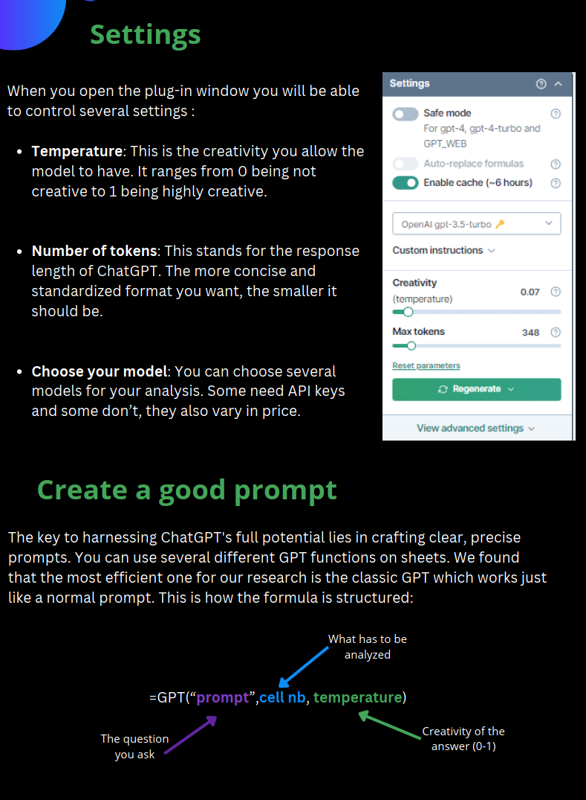

```{r setup, include=FALSE}
knitr::opts_chunk$set(
  collapse = TRUE,
  comment = "#>",
  echo = FALSE,  # Temporarily set to TRUE for debugging
  message = FALSE,
  warning = FALSE
)
```

```{r packages,include=F,eval=T,echo=F}
if (!requireNamespace("pacman", quietly = TRUE)) {
  install.packages("pacman")
}
pacman::p_load(
  ERAg, ERAgON, shiny, dplyr, treemap, treemapify, plotly, data.table, s3fs, arrow, devtools, gh, htmlwidgets,
  readxl, tm, textstem, caret, xgboost, e1071, ggplot2, scales, tokenizers, Matrix, openalexR, pbapply, httr
)

```

# Introduction

This vignette aims to outline the workflows of the 2024/2025 livestock data extraction. These are some of the key steps we have taken and will be gone over indepth within this vignette:

***1. Generation of search terms***

***2. Using OpenAlex to test the search strings and generate relevance scores***

***3. GPT tagging: using the excel plug in to help speed up screening time***

***4. Screening of papers***

***5. Extraction template***

***6. Updated AOM***

***7. Import script and automated QAQC***

# 1. Generation of search terms

*Unhide to see the script*

This script is designed to conduct a systematic search for livestock-related studies using the OpenAlex API. The aim is to retrieve papers that investigate how changes in animal diets affect outcomes such as weight gain, feed efficiency, and milk yield. Below is a detailed breakdown of the script:

0.  **Setting Up the Workspace Loading Required Packages**: The script uses the pacman package to load data.table for data manipulation and openalexR for accessing the OpenAlex API and aims to be easily reproducible.

    Defining Utility Functions: A helper function add_quotes ensures that multi-word search terms are properly quoted to prevent issues during the query process.

    Setting Directories: The script sets up the directory structure for saving search results and terms. The project directory is dynamically created if it doesn't exist.

1.  **Creating Search Terms Defining Key Term Categories:**

    outcome_terms: Focus on performance metrics (e.g., "weight gain," "milk yield").

    animal_terms: Includes species of interest (e.g., "cattle," "goats").

    region_terms: Covers geographic focus areas (e.g., "Kenya," "Sub-Saharan").

    feed_terms: Pertains to diet and feed types (e.g., "fodders," "forages").

    experiment_terms: Relevant study types (e.g., "feedlot management").

    Processing African-Specific Breeds: A function processes a list of African livestock breeds, cleaning and standardizing breed names.

    Creating Boolean Strings: Search terms are converted into boolean expressions for use in OpenAlex queries (e.g., ("weight gain" OR "feed efficiency")).

2.  **Querying OpenAlex Creating Search Combinations:** Different combinations of the boolean strings are generated to create a comprehensive set of search queries.

    Running Queries: For each search combination:

    The script constructs an API endpoint. It retrieves search results, saving them as .csv files. Filtering by Date and Geography: The script limits the results to studies published between 2018 and 2024, with an optional geographic focus on Africa.

<!-- -->

4.  **Merging and Saving Results Combining Searches:** The results from different queries are merged to ensure a comprehensive dataset. Duplicates are identified and removed.

    Saving Results: The merged dataset is saved in a specified directory for further analysis.

```{r generation of search terms, echo=TRUE, eval=FALSE, include=TRUE, collapse=TRUE}
# ERA livestock update search terms
# 0) Set up workspace ####
  # 0.1) Load packages #####
  # Use p_load to install if not present and load the packages
  pacman::p_load(data.table,openalexR)
  
  # 0.2) Create functions #####
  add_quotes <- function(vector) {
    sapply(vector, function(term) {
      if (grepl("\\s", term)) {
        return(shQuote(term, type = "cmd"))
      } else {
        return(term)
      }
    }, USE.NAMES = FALSE)
  }
  # 0.3) Set directories & project ######
  project<-era_projects$livestock_2024
  
  search_data_dir<-file.path(era_dirs$era_search_dir,project)
  if(!dir.exists(search_data_dir)){
    dir.create(search_data_dir,recursive = T)
  }
  
# 1) Create terms ####
# Read in additional animal breed terms provided by Claudia Arndt's team
outcome_terms <- c("animal performance", 
                   "ADG",
                   "average daily gain", 
                   "beef yield", 
                   "body weight gain",
                   "calving rate", 
                   "carcase weight", 
                   "carcass weight", 
                   "dairy production", 
                   "matter intake",
                   "feed consumption",
                   "feed conversion", 
                   "feed efficiency", 
                   "feed intake", 
                   "feeding efficiency", 
                   "growth performance",
                   "lactation performance", 
                   "lactation yield", 
                   "liveweight gain",
                   "meat yield", 
                   "milk output", 
                   "milk production",
                   "milk yield", 
                   "production efficiency", 
                   "weight gain", 
                   "DMI", 
                   "digestibility", 
                   "digestible acid",
                   "digestible fibre", 
                   "digestible cellulose",
                   "crude fat", 
                   "crude protein",
                   "crude lipid", 
                   "digestible energy",
                   "digestible fat", 
                   "digestible lipid",
                   "detergent fibre", 
                   "detergent lignin", 
                   "digestible nitrogen",
                   "ether extract")

outcome_terms_extra<-c("yield","performance","production")
outcome_terms_extra2<-c("energy utilization",
                        "nitrogen utilization",
                        "energy utilisation",
                        "nitrogen utilisation",
                        "energy output",
                        "energy intake",
                        "metabolizable energy",
                        "metabolizable nitrogen",
                        "production performance")

# https://docs.openalex.org/how-to-use-the-api/get-lists-of-entities/search-entities
# For most text search we remove stop words and use stemming (specifically, the Kstem token filter) to improve results.
# So words like "the" and "an" are transparently removed, and a search for "possums" will also return records using the word 
# possum." 

animal_terms <- c("goats",
                  "sheep", 
                  "cattle", 
                  "livestock",
                  "cows", 
                  "bulls", 
                  "steers", 
                  "heifers",
                  "ewes",
                  "lambs", 
                  "growers", 
                  "finishers", 
                  "calf", 
                  "yearlings",
                  "kids", 
                  "bullocks",
                  "backgrounders", 
                  "bucks", 
                  "does", 
                  "zebus", 
                  "Bos taurus",
                  "Bos indicus", 
                  "Ovis aries", 
                  "Capra hircus", 
                  "ruminants", 
                  "calves")

animal_terms_update<-c("rams")

region_terms <- c(
  "African",
  "Algeria",
  "Angola",
  "Benin",
  "Botswana",
  "Burkina Faso",
  "Burundi",
  "Cabo Verde",
  "Cameroon",
  "Central African Republic",
  "CAR",
  "Chad",
  "Comoros",
  "Congo",
  "Cote d'Ivoire",
  "Ivory Coast",
  "Djibouti",
  "Egypt",
  "Equatorial Guinea",
  "Eritrea",
  "Ethiopia",
  "Eswatini",
  "Gabon",
  "Gambia",
  "Ghana",
  "Guinea",
  "Kenya",
  "Lesotho",
  "Liberia",
  "Libya",
  "Madagascar",
  "Malawi",
  "Mali",
  "Mauritania",
  "Mauritius",
  "Morocco",
  "Mozambique",
  "Namibia",
  "Niger",
  "Nigeria",
  "Rwanda",
  "Sao Tome",
  "Principe",
  "Senegal",
  "Seychelles",
  "Sierra Leone",
  "Somalia",
  "South Africa",
  "South Sudan",
  "Sudan",
  "Swaziland",
  "Tanzania",
  "Togo",
  "Tunisia",
  "Uganda",
  "Zambia",
  "Zimbabwe",
  "Sahara",
  "Sub-Saharan",
  "Sahel",
  "DRC"
)

# load africa specific breeds
process_breeds <- function(breeds) {
  # Load necessary library
  library(stringr)
  
  # Initialize an empty vector to store processed breeds
  processed_breeds <- c()
  
  # Iterate over each breed in the input vector
  for (breed in breeds) {
    # Remove punctuation and convert to lowercase
    breed <- tolower(breed)
    breed<-gsub("/"," ",breed)
    
    # Split on parentheses to extract words within them
    parts <- str_split(breed, "\\s*\\(\\s*|\\s*\\)\\s*", simplify = TRUE)
    
    # Add each part to the processed breeds vector
    processed_breeds <- c(processed_breeds, parts[parts != ""])
  }
  
  return(processed_breeds)
}
africa_breeds<-fread("https://raw.githubusercontent.com/CIAT/ERA_dev/main/data/search_history/livestock_2024/african_livestock_breeds.csv")
africa_breeds<-process_breeds(breeds=africa_breeds$breed)
# Remove breeds that are commonly used words
africa_breeds<-africa_breeds[!africa_breeds %in% c("delta","dwarf","somali","taitataveta","pare","hammer","british alpine",
                                                   "alpine goat","forest goat","corriedale","hampshire down","meatmaster",
                                                   "bovines of tete","grassland dwarf","chèvre naine","chèvre naine des savanes",
                                                   "pygmy",'toggenburger',"angora","damascus","blackhead persian","romney marsh",
                                                   "barbary","ram ewe","anglo-nubian goat","afar bhs","angora","caprivi sanga",
                                                   "maure black maure","mere","merino","morcia granada"
                                                   )]
africa_breeds<-africa_breeds[!grepl(paste0(tolower(region_terms),collapse = "|"),africa_breeds)]
africa_breeds<-gsub(" goat| zebu","",africa_breeds)
africa_breeds[grep("boran",africa_breeds)]<-"boran"
africa_breeds[grep("fulani",africa_breeds)]<-"fulani"
africa_breeds<-c(africa_breeds,"sahelian","majorera")


africa_breeds<-sort(unique(africa_breeds))

# Create a vector called feed_terms with each term as an element
feed_terms <- c(
  "rations",
  "feeds",
  "diets",
  "byproducts",
  "supplements",
  "ingredients",
  "nutrients",
  "fodders",
  "forages",
  "silages",
  "hay",
  "grazing",
  "feedstuffs",
  "pastures",
  "cut-and-carry",
  "grasses",
  "concentrates",
  "meals",
  "brans",
  "cakes",
  "straw",
  "haulms",
  "hulls",
  "pellets",
  "mash",
  "blocks"
)

# Create a vector called experiment_terms with each term as an element
experiment_terms <- c(
  "experiments",
  "trials",
  "station",
  "facility",
  "in-vivo",
  "feedlots",
  "controlled study",
  "observational study",
  "grazing management",
  "ruminant nutrition",
  "feedlot management"
)

  # 1.1) Convert to boolean ####

terms <-add_quotes(outcome_terms)
outcome_boolean<-paste0("(",paste0(terms,collapse = " OR "),")")

terms <-add_quotes(c(outcome_terms,outcome_terms_extra))
outcome_2_boolean<-paste0("(",paste0(terms,collapse = " OR "),")")

terms <-add_quotes(c(outcome_terms,outcome_terms_extra2))
outcome_3_boolean<-paste0("(",paste0(terms,collapse = " OR "),")")

terms <-add_quotes(animal_terms)
animal_boolean<-paste0("(",paste0(terms,collapse = " OR "),")")

terms <-add_quotes(c(animal_terms,animal_terms_update))
animal_2_boolean<-paste0("(",paste0(terms,collapse = " OR "),")")

terms <-add_quotes(region_terms)
region_boolean<-paste0("(",paste0(terms,collapse = " OR "),")")

terms <-add_quotes(c(africa_breeds[1:71]))
breeds_1_boolean<-paste0("(",paste0(terms,collapse = " OR "),")")

terms <-add_quotes(c(africa_breeds[72:length(africa_breeds)]))
breeds_2_boolean<-paste0("(",paste0(terms,collapse = " OR "),")")

terms <-add_quotes(feed_terms)
feed_boolean<-paste0("(",paste0(terms,collapse = " OR "),")")

terms <-add_quotes(experiment_terms)
experiment_boolean<-paste0("(",paste0(terms,collapse = " OR "),")")

terms<-list(l1=outcome_boolean,
            l1.1=outcome_2_boolean,
            l1.2=outcome_3_boolean,
            l2=animal_boolean,
            l2.2=animal_2_boolean,
            l3=region_boolean,
            l4=feed_boolean,
            l5=experiment_boolean,
            l6.1=breeds_1_boolean,
            l6.2=breeds_2_boolean)

# 1.2) Save terms #####
save(terms,file=file.path(search_data_dir,"terms.RData"))

# 2) Query OpenAlex ####
  # 2.1) Search with geographic terms ####
    # 2.1.1) Create searches ######
    
    # Note another approach can be to just download the search elements and then combine these,
    # Although I suspect it would return a lot of hits
    
    searches<-list(
      paste0("l",1:5),
      paste0("l",1:4),
      paste0("l",1:3),
      #paste0("l",c(1.1,2:5)),
      #paste0("l",c(1.1,2:4)),
      #paste0("l",c(1.1,2:3)),
      paste0("l",c(1.2,2:5)),
      paste0("l",c(1.2,2:4)),
      paste0("l",c(1.2,2:3)),
      
      paste0("l",c(1,2.2,3:5)),
      paste0("l",c(1,2.2,3:4)),
      paste0("l",c(1,2.2,3)),
      #paste0("l",c(1.1,2.2,3:5)),
      #paste0("l",c(1.1,2.2,3:4)),
      #paste0("l",c(1.1,2.2,3)),
      paste0("l",c(1.2,2.2,3:5)),
      paste0("l",c(1.2,2.2,3:4)),
      paste0("l",c(1.2,2.2,3)),
      
      paste0("l",c(1,2.2,6.1,4:5)), 
      paste0("l",c(1,2.2,6.1,4)),
      paste0("l",c(1,2.2,6.1)),
      #paste0("l",c(1.1,2.2,6.1,4:5)), 
      #paste0("l",c(1.1,2.2,6.1,4)),
      #paste0("l",c(1.1,2.2,6.1)),
      paste0("l",c(1.2,2.2,6.1,4:5)), 
      paste0("l",c(1.2,2.2,6.1,4)),
      paste0("l",c(1.2,2.2,6.1)),
      
      paste0("l",c(1,2.2,6.2,4:5)),
      paste0("l",c(1,2.2,6.2,4)),
      paste0("l",c(1,2.2,6.2)), 
      #paste0("l",c(1.1,2.2,6.2,4:5)),
      #paste0("l",c(1.1,2.2,6.2,4)),
      #paste0("l",c(1.1,2.2,6.2)),
      paste0("l",c(1.2,2.2,6.2,4:5)),
      paste0("l",c(1.2,2.2,6.2,4)),
      paste0("l",c(1.2,2.2,6.2))
    )
    
    s_names<-sapply(searches,FUN=function(x){paste0(gsub("l","",unlist(x)),collapse="")})
    
    search_strings<-lapply(searches,FUN=function(x){
      paste0(unlist(terms[x]),collapse=" AND ")
    })
    
    searches<-data.table(terms=sapply(searches,paste,collapse="|"),search_name=s_names,string=unlist(search_strings))
    
    searches[,encoded_string:=URLencode(string)][,nchar:=nchar(encoded_string)]
    
    searches[,list(search_name,nchar)]
    
    openalex_dates_file<-file.path(search_data_dir,"openalex_search_dates.csv")
    
    if(file.exists(openalex_dates_file)){
      search_dates<-fread(openalex_dates_file)[,search_date:=as.Date(search_date)]
    }else{
      search_dates<-data.table(search_name=as.character(NULL),search_date=as.Date(NULL))
    }
    
    save(searches,file=file.path(search_data_dir,"oa_searches_geo.RData"))
    
    # 2.1.2) Run query ######
    # Define the year constraints
    from_year <- "2018-01-01"
    to_year <- "2024-05-23"
    
    overwrite<-T
    full<-F
    
    if(full){
      prefix<-"openalex"
    }else{
      prefix<-"openalex_ta-only"
    }
    
    for(i in 1:nrow(searches)){
      search_code<-searches$search_name[i]
    
      save_file<-file.path(search_data_dir,paste0(prefix,"_",search_code,".csv"))
    
      cat(i,"-",save_file,"\n")
      
      if(!file.exists(save_file)|overwrite==T){
    
      # Filters
      # https://docs.openalex.org/how-to-use-the-api/get-lists-of-entities/filter-entity-lists
      # https://docs.openalex.org/api-entities/works/filter-works
      
        api_endpoint<-oa_query(entity="works",
                               title_and_abstract.search=searches$string[i],
                               from_publication_date=from_year,
                               to_publication_date=to_year)
        
        if(!full){
          api_endpoint<-paste0(api_endpoint,"&select=title,doi")
        }
        
        if(nchar(api_endpoint)>4000){
          stop(paste0("Encoded search string has ",nchar(api_endpoint)," characters. Max allowed is 4000?"))
        }
      
      # How many hits do we have?
      cat("search =", search_code,"| search hits =",oa_request(query_url=api_endpoint,count_only=T)$count,"\n")
      
      hits<-oa_request(
        query_url=api_endpoint
      )
      
      hits_tab<-data.table(oa2df(hits,entity = "works"))
      
      if(full){
        hits_tab<-hits_tab[,list(id,display_name,author,ab,doi,url,relevance_score,is_oa,language,type,publication_date)]
        # Convert author to non-list form
        hits_tab[,authors:=unlist(lapply(1:nrow(hits_tab),FUN=function(i){
          authors<-hits_tab[i,author][[1]]
          if(length(authors)>1){
            paste0(authors[,"au_display_name"],collapse=";")
          }else{
            NA
          }
          
        }))][,author:=NULL]
      }
    
      fwrite(hits_tab,file=save_file)
      
      # Update dates
      search_dates<-search_dates[search_name != paste0(prefix,"_",search_code)]
      search_dates<-unique(rbind(search_dates,data.table(search_name=paste0(prefix,"_",search_code),search_date=Sys.Date())))
      }
      
      fwrite(search_dates,file=openalex_dates_file)
    }
    
    # 2.1.3) Merge & save results #####
    
    merge_searches<-function(combine,search_data_dir,full){
    
    files<-list.files(search_data_dir,".csv$",full.names = T)
    
    if(full){
      files<-files[!grepl("openalex_ta-only_",files)]
      prefix<-"openalex"
    }else{
      files<-files[grepl("openalex_ta-only_",files)]
      prefix<-"openalex_ta-only"
    }
    
    search_dat<-lapply(files,fread)
    names(search_dat)<-gsub(".csv","",unlist(tail(tstrsplit(files,"_"),1)))
    
    # Combine searches
    
    # Order is important here the function will conduct a merge of search names that contain the first element with the second two elements
    # that match on the other search elements. So if we have abcd, abcde, abe, abf and combine = c("e","f") the function will pick out
    # elements "abcde" and  "abe". For each of these selected elements and the search names the values from combine are removed the 
    # list giving  abcd and ab selected and  abd, abcd, ab, ab in the list. Searches that search the selected name are then combined, in
    # this case abe and abf would be combined, but there is nothing to combine abcde with.
    sterms<-searches$terms
    terms_sub<-gsub(paste(combine,collapse = "|"),"",sterms)
    # Remove combined searches that contain sub elements that are listed in the combine argument
    rm_terms<-grepl("[|][+]|[+][+]",terms_sub)
    terms_sub<-terms_sub[!rm_terms]
    
    # Remove trailing | and ||
    terms_sub<-gsub("||","|",terms_sub,fixed=T)
    terms_sub <- sub("\\|$", "", terms_sub)
    
    comb_n<-which(grepl(combine[1],sterms) & !rm_terms)
    
    search_new<-rbindlist(lapply(comb_n,FUN=function(i){
      term<-terms_sub[i]
      lists<-terms_sub==term
      
      if(sum(lists)!=length(combine)){
        stop(paste0("Issue with combination of lists. Not enough elements are being combined. Check all searches have downloaded to ",search_data_dir))
      }
      
      if(!all(searches$search_name[lists] %in% names(search_dat))){
        stop(paste0("Issue with combination of lists. Names in searches object not matching files in ",search_data_dir,".  Check all searches have downloaded."))
      }
      
      search_comb<-unique(rbindlist(search_dat[searches$search_name[lists]]))
      
      search_new<-data.table(terms=paste(sort(c(paste(sort(combine),collapse="+"),unlist(strsplit(term,"[|]")))),collapse="|"))
      search_new[,search_name:=gsub("l|[|]","",terms)
                 ][,string:=paste0("Searches merged:",paste0(searches$search_name[lists],collapse = "+"))
                   ][,encoded_string:=NA
                     ][,nchar:=NA
                       ][,search_date:=as.Date(NA)]
      
      fwrite(search_comb,file.path(search_data_dir,paste0(prefix,"_",search_new$search_name,".csv")))
      
      search_new
    }))
    
    return(search_new)
    }
    
    searches_merged<-merge_searches(combine=paste0("l",c(6.1, 6.2,3)),
                             search_data_dir=search_data_dir,
                             full=F)
    
    searches_all<-unique(rbindlist(list(searches,searches_merged),use.names = T))
    
    fwrite(file.path(search_data_dir,"searches.csv"))
    
  # 2.2) Search without geographic term, insteade author institution location to geographical filter research ####
    # 2.1.1) Create searches ######
    searches<-list(
      paste0("l",c(1:2,4:5)),
      paste0("l",c(1:2,4)),
      paste0("l",1:2),
      #paste0("l",c(1.1,2,4:5)),
      #paste0("l",c(1.1,2,4)),
     # paste0("l",c(1.1,2)),
      paste0("l",c(1.2,2,4:5)),
      paste0("l",c(1.2,2,4)),
     # paste0("l",c(1.2,2)),
      paste0("l",c(1,2.2,4:5)),
      paste0("l",c(1,2.2,4)),
      paste0("l",c(1,2.2)),
      #paste0("l",c(1.1,2.2,4:5)),
      #paste0("l",c(1.1,2.2,4)),
     # paste0("l",c(1.1,2.2)),
      paste0("l",c(1.2,2.2,4:5)),
      paste0("l",c(1.2,2.2,4)),
      paste0("l",c(1.2,2.2))
    )
    
    s_names<-sapply(searches,FUN=function(x){paste0(gsub("l","",unlist(x)),collapse="")})
    
    search_strings<-lapply(searches,FUN=function(x){
      paste0(unlist(terms[x]),collapse=" AND ")
    })
    
    searches<-data.table(terms=sapply(searches,paste,collapse="|"),search_name=s_names,string=unlist(search_strings))
    
    searches[,encoded_string:=URLencode(string)][,nchar:=nchar(encoded_string)]
    
    openalex_dates_file<-file.path(search_data_dir,"openalex_search_dates.csv")
    
    if(file.exists(openalex_dates_file)){
      search_dates<-fread(openalex_dates_file)[,search_date:=as.Date(search_date)]
    }else{
      search_dates<-data.table(search_name=as.character(NULL),search_date=as.Date(NULL))
    }
    
    save(searches,file=file.path(search_data_dir,"oa_searches_auth.RData"))
    
    # 2.2.2) Run query ######
    overwrite<-F
    full<-F
    
    if(full){
      prefix<-"openalex"
    }else{
      prefix<-"openalex_ta-only"
    }
    
    download<-T
    
    continent<-"africa"
    
    for(i in 1:nrow(searches)){
      search_code<-searches$search_name[i]
    
      save_file<-file.path(search_data_dir,paste0(prefix,"_",search_code,".csv"))
      
      cat(i,"-",save_file,"\n")
      
      if(!file.exists(save_file)|overwrite==T){
        
    
        # Filters
        # https://docs.openalex.org/how-to-use-the-api/get-lists-of-entities/filter-entity-lists
        # https://docs.openalex.org/api-entities/works/filter-works
        
        if(is.null(continent)){
          api_endpoint<-oa_query(entity="works",
                                 title_and_abstract.search=searches$string[i],
                                 from_publication_date=from_year,
                                 to_publication_date=to_year)
        }else{
          api_endpoint<-oa_query(entity="works",
                               title_and_abstract.search=searches$string[i],
                               authorships.institutions.continent=continent,
                               from_publication_date=from_year,
                               to_publication_date=to_year)
        }
        
        if(!full){
          api_endpoint<-paste0(api_endpoint,"&select=title,doi")
        }
        
        if(nchar(api_endpoint)>4000){
          stop(paste0("Encoded search string has ",nchar(api_endpoint)," characters. Max allowed is 4000?"))
        }
        
        
        # How many hits do we have?
        n_hits<-oa_request(query_url=api_endpoint,count_only=T)$count
        cat("search =", search_code,"| search hits =",n_hits,"\n")
        n_hits<-data.table(search_name=search_code,hits=n_hits)
        
        if(i==1){
         n_hits_tab<-n_hits
        }else{
          n_hits_tab<-rbind(n_hits_tab,n_hits)
        }
        
        if(download){
          hits<-oa_request(
            query_url=api_endpoint
          )
          
          hits_tab<-data.table(oa2df(hits,entity = "works"))
          
          if(full){
            hits_tab<-hits_tab[,list(id,display_name,author,ab,doi,url,relevance_score,is_oa,language,type,publication_date)]
            
            # Convert author to non-list form
            hits_tab[,authors:=unlist(lapply(1:nrow(hits_tab),FUN=function(i){
              authors<-hits_tab[i,author][[1]]
              if(length(authors)>1){
                paste0(authors[,"au_display_name"],collapse=";")
              }else{
                NA
              }
              
            }))][,author:=NULL]
          }
          
          fwrite(hits_tab,file=save_file)
          
          # Update dates
          search_dates<-unique(rbind(search_dates,data.table(search_name=paste0(prefix,"_",search_code),search_date=Sys.Date())))
          fwrite(search_dates,file=openalex_dates_file)
        }else{
          n_hits_tab
        }
      }
    }
    
    # 2.2.3) Merge & save results #####
    searches_all<-rbind(searches_all,searches)
    fwrite(searches_all,file.path(search_data_dir,"searches.csv"))
      

```

# 2. Using OpenAlex to test the search strings and generate relevance scores

This script automates the process of downloading, cleaning, and analyzing search results related to livestock diets from various scientific databases. It uses machine learning and statistical techniques to assess the relevance of the search results, validate them against a manual dataset, and evaluate the performance of different search strategies.

Step-by-Step Explanation

1.  **Set Up the Environment Load Required Packages:** The script uses pacman::p_load to load necessary R packages like readxl, data.table, xgboost, ggplot2, and others for data processing and analysis. Set Directories: Two directories are defined: search_data_dir: Stores downloaded search results. search_data_dir_prj: Stores project-specific data for the "Courageous Camel" project.

2.  **Download and Unzip Data:** The script downloads a ZIP file containing historical livestock search data from an S3 URL. If the data directory is empty or the update flag is set to TRUE, the ZIP file is downloaded, extracted, and cleaned up.

3.  **Load Search History Historical Search Records:** Reads a CSV file (search_history.csv) containing past searches and converts the search_date column to Date format. OpenAlex Search Results: Loads search results from OpenAlex and merges them into the historical search records, ensuring a consistent format.

4.  **Validation Data Manual Validation Data:** Loads a manually curated dataset (search_manual.csv) that contains papers expected to match the search results. Cross-Reference with OpenAlex: Validates the OpenAlex search results against the manual data using DOIs and titles. Calculates metrics like the number of unique DOIs found in OpenAlex, Scopus, and Web of Science (WOS).

5.  **Load Search Results Merge Search Data:** Loads search results from three databases (WOS, Scopus, and OpenAlex) and harmonizes their fields for consistency. Data Cleaning: Removes irrelevant documents like corrections, errata, and editor evaluations. Cross-Reference with Manual Data: Identifies which search results overlap with the manual validation dataset.

6.  **Performance Evaluation Assess Search Strategies:** Evaluates the performance of different search strategies by calculating the percentage of manual dataset papers captured by each search. Identifies the "best" search based on performance and number of hits. Summarize Results: Summarizes the final search results and saves them for future use.

7.  **Run Final Search Top Performing Searches:** Runs the top two search strategies and combines their results. Saves the final merged search results, ensuring all relevant papers are included.

8.  **Machine Learning for Keyword Extraction:**

    Data Preparation: Combines abstracts and keywords from livestock-related papers and preprocesses the text.

    Create Document-Term Matrix: Tokenizes the text into unigrams and bigrams, removes stop words, and creates a sparse matrix.

    Train XGBoost Model: Splits the data into training and testing sets and trains an XGBoost model to classify relevant papers based on the processed text.

    Evaluate Model: Makes predictions on the test set and evaluates the model's accuracy using a confusion matrix.

    Feature Importance: Calculates SHAP values to identify the most influential features in the model and visualizes the top 20 influential features using a bar plot.

```{r search term validation, echo=TRUE, eval=FALSE, include=TRUE, collapse=TRUE}
# First run R/0_set_env.R
# 0) Load packages ####
pacman::p_load(readxl, tm, textstem, caret, xgboost, e1071,ggplot2,scales,tokenizers,Matrix,data.table,openalexR,pbapply)

# 1) Set-up workspace ####
  # 1.1) Set directories #####
project<-era_projects$courageous_camel_2024
search_data_dir<-file.path(era_dirs$era_search_dir,project)
search_data_dir_prj<-file.path(era_dirs$era_search_prj,project)

# 2) Download era data from s3 - THIS NEEDS TO BE UPDATED THE PATHS ARE NO LONGER CORRECT ####
update<-F

s3_file<-"https://digital-atlas.s3.amazonaws.com/era/data_entry/data_entry_2024/search_history/livestock_2024/livestock_2024.zip"
local_file<-file.path(search_data_dir,basename(s3_file))

if(length(list.files(search_data_dir))<1|update==T){
  options(timeout = 300) 
  download.file(s3_file, destfile = local_file)
  unzip(local_file, exdir = search_data_dir,overwrite=T,junkpaths=T)
  unlink(local_file)
}

# 3) Load search history ####
search_history<-fread(file.path(search_data_dir_prj,"search_history.csv"))[,-1]
search_history[,search_date:=as.Date(trimws(search_date), format = "%d-%b-%y")]

search_history_oa<-fread(file.path(search_data_dir,"searches.csv"))[,list(terms,search_name,search_date)]
setnames(search_history_oa,c("terms","search_name"),c("search_name","filename"))
search_history_oa[,citation_db:="openalex"
                  ][,timeframe:="all"
                    ][,filename:=paste0("openalex_ta-only_",filename,".csv")
                      ][,search_date:=as.Date(search_date)]

search_history<-rbindlist(list(search_history,search_history_oa),use.names = T)

# 4) Load validation data ####
  # 4.1) Load titles that should be included #####
  search_manual<-fread(file.path(search_data_dir_prj,"search_manual.csv"))
  search_manual<-search_manual[,year:=as.numeric(year)
                               ][year>=2018
                                 ][,doi:=trimws(gsub("https://doi.org/|http://dx.doi.org/","",doi))
                                   ][,title:=trimws(tolower(title))]
  
  # 4.2) Check which dois & titles are in openalex #####
  # dois
  oa_dois<-data.table(oa_fetch(
    entity = "works",
    doi = search_manual[!is.na(doi),doi],
    verbose = TRUE
  ))[,indexed_oa:="yes"
     ][,list(doi,indexed_oa)
       ][,doi:=trimws(gsub("https://doi.org/|http://dx.doi.org/","",doi))]
  
  # titles
  oa_titles<-rbindlist(lapply(1:nrow(search_manual),FUN=function(i){
      data<-data.table(oa_fetch(
        entity = "works",
        display_name.search = gsub("[^a-zA-Z0-9 ]", "",search_manual[i,title]),
       verbose = TRUE
    ))[,indexed_oa:="yes"
       ][,list(title,indexed_oa)]
    data
  }))
  
  # Merge oa results with the the validation data
  search_manual<-merge(search_manual,oa_dois,all.x=T)
  search_manual[is.na(indexed_oa),indexed_oa:="no"]
  
  search_manual[,list(total_dois=sum(!is.na(doi)),
                                     wos=sum(indexed_wos=="yes"),
                                     wos_unique=sum(indexed_wos=="yes" & indexed_scopus=="no" & indexed_oa=="no"),
                                     scopus=sum(indexed_scopus=="yes"),
                                     scopus_unique=sum(indexed_wos=="no" & indexed_scopus=="yes" & indexed_oa=="no"),
                                     openalex=sum(indexed_oa=="yes"),
                                     openalex_unique=sum(indexed_wos=="no" & indexed_scopus=="no" & indexed_oa=="yes"),
                                     any=sum(indexed_wos=="yes"|indexed_scopus=="yes"|indexed_oa=="yes"),
                                     scopus_openalex=sum(indexed_scopus=="yes"|indexed_oa=="yes"))]
  
# 5) Load search results ####
search_files<-list.files(search_data_dir,full.names = T)

  # 5.1) wos #####
  search_files_wos<-grep("wos_",search_files,value = T)
  
  wos_searches<-rbindlist(pblapply(1:length(search_files_wos),FUN=function(i){
    file<-search_files_wos[i]
    data<-data.table(readxl::read_xls(file))
    data[,search:=basename(file)]
    data
  }))[,citation_db:="wos"
      ][,search:=gsub("_a.xls|_b.xls|_c.xls|_d.xls|_e.xls|_f.xls|_g.xls|_h.xls|_i.xls","",search)
        ][,search:=gsub(".xls","",search)
          ][grepl("Article",`Document Type`)# Keep only articles
            ][,relevance_score:=NA] 
  
  # 5.2) scopus #####
  search_files_scopus<-grep("scopus_",search_files,value = T)
  
  scopus_searches<-rbindlist(pblapply(1:length(search_files_scopus),FUN=function(i){
    file<-search_files_scopus[i]
    data<-fread(file)
    data[,search:=basename(file)]
    data
    }))[,citation_db:="scopus"
        ][,search:=gsub(".csv","",search)
          ][grepl("Article",`Document Type`)
            ][,relevance_score:=NA]
  
  # 5.3) openalex #####
  search_files_oa<-grep("openalex_ta-only",search_files,value = T)
  oa_searches<-rbindlist(pblapply(1:length(search_files_oa),FUN=function(i){
    file<-search_files_oa[i]
    data<-fread(file)
    data[,search:=basename(file)]
    data
  }))[,citation_db:="openalex"
      ][,search:=gsub(".csv","",search)
        ][,ab:=NA
          ][,keywords:=NA
            ][,authors:=NA
              ][,id:=NA
                ][,relevance_score:=NA
                  ][,year:=NA]
  
  # 5.4) Harmonize fields between citation databases #####
  terms<-c("authors","title","year","doi","abstract","keywords","search","citation_db","citation_db_id","relevance_score")
  wos<-c("Authors","Article Title","Publication Year","DOI","Abstract","Author Keywords","search","citation_db","UT (Unique WOS ID)","relevance_score")
  scopus<-c("Authors","Title","Year","DOI","Abstract","Author Keywords","search","citation_db","EID","relevance_score")
  oa<-c("authors","title","year","doi","ab","keywords","search","citation_db","id","relevance_score")
  
  # 5.5) Merge data #####
  wos_searches<-wos_searches[,..wos]
  setnames(wos_searches,wos,terms)
  
  scopus_searches<-scopus_searches[,..scopus]
  setnames(scopus_searches,scopus,terms)
  
  oa_searches<-oa_searches[,..oa]
  setnames(oa_searches,oa,terms)
  
  searches<-rbind(wos_searches,scopus_searches,oa_searches)
  searches[,search:=gsub("wos_|scopus_|openalex_","",search)]
  
  searches[,list(doi_n=length(unique(doi[!is.na(doi)])),doi_na=sum(is.na(doi))),by=search]
  
  searches[,doi:=gsub("https://doi.org/","",doi)]
  
  searches[,search:=gsub("ta-only_","",search)]
  
  # Remove corrections, corrigendum and erratum
  remove_phrases<-c("correction to:","corrigendum to:","erratum","editor's evaluation")
  searches<-searches[!grepl(paste0(remove_phrases,collapse = "|"),title,ignore.case = T)]
  
  # 5.6) Cross reference to manual search #####
  # remove manual targets that did not appear to be in citation dbs?
  rm_no_citation_db<-F
  search_manual[,doi:=tolower(trimws(gsub("https://doi.org/|http://dx.doi.org/","",doi)))]
  if(rm_no_citation_db){
    no_citation_db<-search_manual[indexed_wos=="no" & indexed_scopus=="no" & indexed_oa=="no" & !is.na(doi),doi]
    doi_targets<-search_manual[!is.na(doi) | !doi %in% no_citation_db,doi]
  }else{
    doi_targets<-search_manual[!is.na(doi),doi]
  }
  
  # Match dois
  #searches[,target_doi:=F][grep(paste0(doi_targets,collapse="|"),doi),target_doi:=T]
  searches[,target_doi:=doi[1] %in% doi_targets,by=doi]
  searches[,list(performance=round(sum(target_doi)/nrow(search_manual),2)),by=list(search,citation_db)][order(performance,decreasing=T)]
  
  # Match titles
  title_targets<-search_manual[,trimws(tolower(title))]
  searches[,target_title:=grepl(paste0(title_targets,collapse="|"),title)]
  searches[,list(performance=round(sum(target_title)/nrow(search_manual),2)),by=list(search,citation_db)][order(performance,decreasing=T)]
  
  # Combine doi and title matches
  searches[,target_any:=F][target_title|target_doi,target_any:=T]
  
  # 5.7) Assess search performance #####
  search_perf<-searches[,list(search,citation_db,doi,title,target_doi,target_title,target_any)][,hits:=.N,by=search]
  
  search_perf[,list(performance=round(sum(target_any)/nrow(search_manual),2)),by=list(search,citation_db,hits)][order(performance,decreasing = T)]
  
  (perf_search_db<-search_perf[target_any==T,list(performance=round(length(unique(title))/nrow(search_manual),2)),by=list(search,citation_db,hits)][order(performance,decreasing = T)])
  (perf_search<-search_perf[target_any==T,list(performance=round(length(unique(title))/nrow(search_manual),2)),by=list(search)][order(performance,decreasing = T)])
  (perf_all<-search_perf[target_any==T,list(performance=round(length(unique(title))/nrow(search_manual),2))])
  
  best_search<-perf_search_db[performance==max(performance)][hits==min(hits),search]
  
    # 5.7.1) What papers are in what databases? ######
    search_perf[citation_db=="openalex" & target_any==T,sort(unique(title))]
    search_perf[citation_db=="scopus" & target_any==T,sort(unique(title))]
    search_perf[citation_db=="wos" & target_any==T,sort(unique(title))]
    
    # 5.7.2) Append search results to validation table #####
    search_manual[,ID:=1:.N]
    hits<-search_manual[,list(ID,title,doi,indexed_wos,indexed_scopus,indexed_oa)
                        ][,title:=trimws(tolower(title))
                          ][,doi:=trimws(tolower(doi))
                            ][,indexed_wos:=indexed_wos=="yes"
                              ][,indexed_scopus :=indexed_scopus =="yes"
                                ][,indexed_oa :=indexed_oa =="yes"
                                  ][,indexed_any:=any(indexed_oa,indexed_scopus,indexed_wos),by=ID
                                    ][,hit_oa:=F
                                      ][,hit_wos:=F
                                        ][,hit_scopus:=F]
    
    hits[title %in% search_perf[citation_db=="openalex" & target_any==T,unique(title)]|
           doi %in% search_perf[citation_db=="openalex" & target_any==T,unique(doi)],hit_oa:=T]
         
    hits[title %in% search_perf[citation_db=="wos" & target_any==T,unique(title)]|
           doi %in% search_perf[citation_db=="wos" & target_any==T,unique(doi)],hit_wos:=T]     
    
    hits[title %in% search_perf[citation_db=="scopus" & target_any==T,unique(title)]|
           doi %in% search_perf[citation_db=="scopus" & target_any==T,unique(doi)],hit_scopus:=T]     
    
    hits[,hit_any:=any(hit_oa,hit_wos,hit_scopus),by=ID]
    
    # Indexed OA result not found
    search_manual[ID %in% hits[indexed_oa & !hit_oa,ID],list(title,keywords,abstract,doi)]
    
    # Wos result not in OA
    search_manual[ID %in% hits[hit_wos & ! hit_oa,ID]]
    
    # Scopus result not in OA
    search_manual[ID %in% hits[hit_scopus & ! hit_oa,ID]]
    
    # 5.7.3) What hits are in other openalex searches but not in the top search? ######
    oa_best<-search_perf[citation_db=="openalex" & search==best_search & target_any,list(doi,title)][,best:=T]
    oa_other<-unique(search_perf[citation_db=="openalex" & search!=best_search & target_any,list(search,doi,title)])
    oa_other<-merge(oa_other,oa_best[,list(doi,title,best)],all.x=T)
    oa_other[is.na(best),unique(title)]
    n<-nrow(unique(oa_other[is.na(best),list(doi,title)]))
    oa_second<-perf_search_db[search %in% oa_other[is.na(best),list(N=.N),by=search][N==n,search]][hits==min(hits),search]
    
    # Final search
    nrow(oa_best) # Papers found by best search
    nrow(oa_best)== hits[,sum(hit_any)] # Does it account for all search hits?
    
    # Papers found by top 2 searchs
    final_search<-unique(searches[search %in% c(best_search,oa_second) & citation_db=="openalex",list(doi,title,target_any)])
    final_search[,sum(target_any)]
    # Do these search contain all the hits from all searches?
    final_search[,sum(target_any)] == hits[,sum(hit_any)]
    
    # 5.7.4) Summarize final search ######
    oa_searches[,search2:=gsub(".csv","",tail(unlist(tstrsplit(search[1],"_")),1)),by=search]
    final_search<-unique(oa_searches[,search:=tail(unlist(tstrsplit(search[1],"_")),1),by=search][search %in% c(best_search,oa_second)][,search:=NULL])
    
    # 6) Run full retrival for final search ####
    # Source era helper function for running oa search
    source("https://raw.githubusercontent.com/CIAT/ERA_dev/main/R/search/era_oa_query.R")
    
    # This is a bit of legacy issue, the .csv saving of the search terms does not appear to retain the formatting needing to run the searches.
    # We need to get the terms then get the search from RData files recording the searches made.
    search_history_oa<-fread(file.path(search_data_dir,"searches.csv"))
    search_1<-search_history_oa[search_name==best_search,string]
    search_2<-search_history_oa[search_name==oa_second,string]
    
    # Check if the search include geo term (T) or not (F)
    grepl("Cabo Verde",search_1)
    grepl("Cabo Verde",search_2)
    
    # Load Rdata versions of the searches
    load.Rdata(file.path(search_data_dir,"oa_searches_auth.RData"),"auth_searches")
    load.Rdata(file.path(search_data_dir,"oa_searches_geo.RData"),"geo_searches")

    # Get the relevant search strings for best and second best searches (which together found all the target pdfs)
    search_1<-auth_searches[terms==search_history_oa[search_name==best_search,terms],string]
    search_2<-geo_searches[terms==search_history_oa[search_name==oa_second,terms],string]
    
    # Set search dates
    from_date <- "2018-01-01"
    to_date <- Sys.Date()
    
    # Run searches
    results_auth<-run_openalex_query(search_terms=search_1, 
                                     from_date = from_date, 
                                     to_date = to_date, 
                                     continent = "africa", 
                                     download = TRUE,
                                     full = TRUE, 
                                     max_char_limit = 4000)
    
    results_geo<-run_openalex_query(search_terms=search_2, 
                                     from_date = from_date, 
                                     to_date = to_date, 
                                     continent = NULL, 
                                     download = TRUE,
                                     full = TRUE, 
                                     max_char_limit = 4000)
    
    results_merged<-unique(rbind(results_auth$results,results_geo$results))
    results_merged[,publication_date:=as.Date(publication_date)]
    results_merged<-results_merged[,.(relevance_min=min(relevance_score),relevance_max=max(relevance_score),relevance_mean=mean(relevance_score),publication_date=publication_date[1]),by=.(id,display_name,ab,doi,url,is_oa,language,type,authors)][order(doi)]
    
    # check for duplicates
    results_merged[!is.na(doi),which(duplicated(doi))]
    results_merged[!is.na(id),which(duplicated(id))]
    results_merged[!is.na(url),which(duplicated(url))]
    dim(results_merged)
    
    # List results and save
    final_results<-list(search1=results_auth,search2=results_geo,combined_results=results_merged)
    save(final_results,file=file.path(search_data_dir,"final_search.RData"))
    

# 6) UNDER DEVELOPMENT- Explore ERA data for keywords to include ####
if(F){
# Simple ####
ERA_papers<-ERA.Compiled[Product.Type=="Animal" & grepl("Feed",PrName),unique(Code)]
data<-ERA_Bibliography[ERACODE %in% ERA_papers]

keywords<-tolower(trimws(unlist(strsplit(data$KEYWORDS,":;"))))
keywords<-trimws(unlist(strsplit(keywords,",")))
keywords<-keywords[!is.na(keywords)]

keywords<-sort(table(keywords),decreasing = T)
keywords[1:20]

# ML basic ####
# Combine abstract and keywords into one text column
data[, combined_text := paste(ABSTRACT, KEYWORDS, sep = " ")]

# Clean and preprocess text
corpus <- Corpus(VectorSource(data$combined_text))
corpus <- tm_map(corpus, content_transformer(tolower))
corpus <- tm_map(corpus, removePunctuation)
corpus <- tm_map(corpus, removeNumbers)
corpus <- tm_map(corpus, removeWords, stopwords("en"))
corpus <- tm_map(corpus, stripWhitespace)
corpus <- tm_map(corpus, lemmatize_strings)

# Identify the most frequent terms:
dtm <- TermDocumentMatrix(corpus)
m <- as.matrix(dtm)
word_freqs <- sort(rowSums(m), decreasing = TRUE)

# Get top N keywords; you can adjust N based on your needs
top_keywords <- names(word_freqs)[1:20]

# Example of constructing a simple Boolean query
boolean_query <- paste(top_keywords, collapse = " OR ")

# ML: Build terms with training data ####
# Load 2013-2018 search history

# Remove any papers we did not have FT access to
data<-ERA_13_18_bib_cleaned[NoAccess==F,list(TITLE,ABSTRACT,KEYWORDS,DOI,ERACODE,Passed.FT,Passed.TA)]

# Set papers not about animal feeding to excluded
data[is.na(ERACODE) | !ERACODE %in% ERA_papers,c("Passed.FT","Passed.TA"):=list(NA,NA)]
setnames(data,c("TITLE","ABSTRACT","KEYWORDS"),c("title","abstract","keywords"))

data<-data[,screened:=0][Passed.FT==T,screened:=1][,list(title,abstract,keywords,screened)]


# Add in additional papers that can be included
data<-rbind(data,search_manual[!is.na(doi),list(title,abstract,keywords)][,screened:=1])

# Downsample the rejected papers to the number of accepted papers
accepted_papers <- data[data$screened == 1]
rejected_papers <- data[data$screened == 0]

# Sample rejected papers
sampled_rejected <- rejected_papers[sample(.N, size = 10*nrow(accepted_papers))]

# Combine accepted and sampled rejected papers
balanced_data <- rbind(accepted_papers, sampled_rejected)

# Shuffle the combined dataset
set.seed(123)
data <- balanced_data[sample(nrow(balanced_data)), ]

# Clean and preprocess text
prepare_text <- function(text) {
  corpus <- Corpus(VectorSource(text))
  corpus <- tm_map(corpus, content_transformer(tolower))
  corpus <- tm_map(corpus, removePunctuation)
  corpus <- tm_map(corpus, removeNumbers)
  corpus <- tm_map(corpus, removeWords, stopwords("en"))
  corpus <- tm_map(corpus, stripWhitespace)
  corpus <- tm_map(corpus, lemmatize_strings)
  return(corpus)
}

# All fields
data$processed_text <- sapply(prepare_text(paste(data$title, data$abstract, data$keywords, sep=" ")), paste, collapse=" ")

# Keywords only
data<-data[!is.na(keywords)]
data$processed_text <- sapply(prepare_text(data$keywords), paste, collapse=" ")

# Create a document-term matrix with TF-IDF weighting
#dtm <- DocumentTermMatrix(data$processed_text, control=list(weighting=weightTfIdf))

# Function to tokenize into unigrams and bigrams

# Define an enhanced list of stop words
enhanced_stop_words <- c(stopwords::stopwords("en"), "na", "x", "p", "c", "etc")

tokenize_bigrams <- function(text,enhanced_stop_words) {
  unigrams <- unlist(tokenizers::tokenize_words(text))
  # automatically filter out stop words
  unigrams <- unigrams[!unigrams %in% enhanced_stop_words & nchar(unigrams) > 1]
  # Remove single characters and specific patterns
  unigrams <- unigrams[grepl("^[a-z]{2,}$", unigrams, ignore.case = TRUE)]
  
  bigrams <- unlist(lapply(seq_len(length(unigrams) - 1), function(i) {
    paste(unigrams[i], unigrams[i + 1])
  }))
  return(c(unigrams, bigrams))
}

# Apply the tokenizer
tokens <- lapply(data$processed_text, tokenize_bigrams,enhanced_stop_words=enhanced_stop_words)

# Flatten and count occurrences for vocabulary
flat_tokens <- unlist(tokens)
vocab <- table(flat_tokens)
vocab <- vocab[vocab >= 5]  # Prune vocabulary to only include terms appearing at least 5 times

# Filter tokens based on vocabulary
filtered_tokens <- lapply(tokens, function(ts) ts[ts %in% names(vocab)])

# Create a mapping of words to column indices
vocab_indices <- match(names(vocab), unique(flat_tokens))

# Initialize an empty list to collect rows
rows_list <- vector("list", length(filtered_tokens))

# Preparing indices and values for the sparse matrix
rows <- integer(0)
cols <- integer(0)
values <- numeric(0)

# Populate the indices and values
for (i in seq_along(filtered_tokens)) {
  token_indices <- match(filtered_tokens[[i]], names(vocab), nomatch = 0)
  valid_indices <- token_indices[token_indices > 0]
  rows <- c(rows, rep(i, length(valid_indices)))
  cols <- c(cols, valid_indices)
  values <- c(values, rep(1, length(valid_indices)))
}

# Combine all rows into a single sparse matrix
dtm <- sparseMatrix(i = rows, j = cols, x = values, dims = c(length(filtered_tokens), length(vocab)), dimnames = list(NULL, names(vocab)))

# Convert to matrix format for machine learning
dtm_matrix<-dtm
#dtm_matrix <- as.matrix(dtm)
#colnames(dtm_matrix) <- make.names(colnames(dtm_matrix))

# Prepare training data
training_index <- createDataPartition(data$screened, p=0.8, list=FALSE)
train_data <- dtm_matrix[training_index,]
test_data <- dtm_matrix[-training_index,]
train_labels <- data$screened[training_index]
test_labels <- data$screened[-training_index]

train_labels <- as.factor(train_labels)  # Convert to factor
test_labels <- as.factor(test_labels)  # Convert to factor


# Train model
model <- train(train_data, train_labels, method="xgbTree",
               trControl=trainControl(method="cv", number=10))

# Evaluate model
predictions <- predict(model, test_data)
confusionMatrix(predictions, test_labels)

# Feature importance
importance <- xgb.importance(feature_names = colnames(train_data), model = model$finalModel)
print(xgb.plot.importance(importance))

# Feature importance 2 

# Extract the raw xgboost model from the caret model
xgb_model <- model$finalModel

# Make sure your feature data is in a matrix form as expected by xgboost
data_matrix <- as.matrix(train_data)

# Create an xgb.DMatrix from your feature data
dtest <- xgb.DMatrix(data = data_matrix)
shap_values <- predict(xgb_model, dtest, predcontrib = TRUE)

# Calculate average SHAP values for each feature
average_shap_values <- colMeans(shap_values[, -ncol(shap_values)], na.rm = TRUE)

# Combine with feature names
feature_importance <- data.frame(Feature = colnames(data_matrix), SHAP_Value = average_shap_values)


# Order by SHAP value to see the most influential features
feature_importance <- feature_importance[order(-abs(feature_importance$SHAP_Value)), ]

# Sorting the features by absolute SHAP values and selecting the top 20
top_features <- feature_importance[order(-abs(feature_importance$SHAP_Value)), ][1:20, ]

# Plotting the top 20 features using ggplot2
ggplot(top_features, aes(x = reorder(Feature, SHAP_Value), y = SHAP_Value, fill = SHAP_Value)) +
  geom_bar(stat = "identity") +
  coord_flip() +  # Flip coordinates to make feature names readable
  labs(title = "Top 20 Features by SHAP Value",
       x = "SHAP Value",
       y = "Feature") +
  scale_fill_gradient2(low = "blue", high = "red", mid = "white", midpoint = 0,
                       name = "SHAP Value",
                       breaks = pretty_breaks(n = 5)) +
  theme_minimal()


}
```

# 3. GPT Tagging

We leveraged the GPT Excel plugin to expedite the screening process for livestock-related papers. The plugin was used to extract specific details directly from the abstracts, such as the country where the experiment was conducted and the type of animals involved.

1.  **Tagging the Country**:

    -   A custom prompt was used to analyze the abstracts in column `{{C}}` of the Excel sheet.

    -   The prompt instructed GPT to extract the name of the country where the experiment was conducted and return "NA" if no country was mentioned.

    -   This helped streamline the process of identifying the geographical focus of each study.

2.  **Tagging Livestock Categories**:

    -   Additional prompts were designed to tag papers based on the specific livestock mentioned, such as cattle, sheep, or goats.

    -   This automated tagging reduced manual effort, allowing the team to quickly categorize and organize the studies by species.

The use of the GPT Excel plugin not only enhanced efficiency but also ensured consistency in the screening and tagging process, which is crucial for large-scale data extraction tasks.

Here are steps to work this the GPT plug in in excel:




# 4. Screening

The screening of papers was then done by consultants.

This screening criteria is designed to systematically review papers focusing on livestock management and outcomes, applying both inclusion and exclusion criteria based on specific parameters. The framework ensures that the selected studies align with the objectives of the review, particularly within the context of livestock systems in Africa.

PICOS Framework The PICOS framework helps structure systematic reviews by defining key components: Population, Intervention, Comparison, Outcomes, and Study Design.

#### *Population (P):*

The criteria focus on studies involving livestock, excluding fish unless explicitly directed (fish are separated into a distinct category). The geographic scope is limited to studies conducted in Africa.

#### *Intervention (I):*

Eligible studies involve practices like: Pasture and grazing management. Feed experiments (including feed processing). Improved variety and herd density management. Manure management and related practices.

#### *Comparison (C):*

Studies should ideally have a control group, except for papers reporting diet and intake where controls are not mandatory.

#### *Outcomes (O):*

The review emphasizes studies reporting primary data on key outcomes: Reproductive performance, economics, yields, soil quality, biodiversity, emissions, and labour. Studies that report surveys or specific emission-related outcomes in controlled environments are included, but consultation with the team is recommended.

#### *Study Design (S):*

Studies must focus on interventions and primary data collection. Lab experiments or greenhouse studies are excluded unless they focus on emission outcomes.

# 5. Extraction template

Consultants went through an extensive training on how to input data from publications into our excel template. The link to the template can be found here: [V1.2.7- Courageous Camel.xlsm](https://cgiar-my.sharepoint.com/:x:/g/personal/p_steward_cgiar_org/EcPbtXN9dINJnnsdXp1KOYABLJuqqKGuJrJCPFePELSZcQ?e=e7xyAo)\
\
This template included the following tabs:

-   **Pub**:\
    This sheet stores bibliographic details, such as publication titles, authors, DOIs, and other metadata.

-   **Site**:\
    This sheet contains detailed information about the research sites, including location, climate, and ecological characteristics.

-   **Site.Soils**:\
    This sheet captures soil data from experimental sites, including soil type, pH, and nutrient composition.

-   **ExpD**:\
    This sheet documents the experimental design, outlining key parameters such as treatments, controls, and replications.

-   **System & Housing**:\
    This sheet focuses on livestock management systems and housing conditions, providing details on the type of housing, ventilation, and animal welfare.

-   **Times**:\
    This sheet records time-related data, including the duration of experiments, sampling intervals, and seasonal variations.

-   **Herd or Group**:\
    This sheet contains data on livestock demographics, such as herd size, age groups, and breed composition.

-   **Diet-Ingredients**:\
    This sheet lists the specific ingredients used in livestock diets, including their quantities and sources.

-   **Diet-Nutrition**:\
    This sheet provides a comprehensive nutritional breakdown of the livestock diets, detailing macronutrient and micronutrient contents.

-   **Diet-Digestibility**:\
    This sheet records data on feed digestibility, including in vivo and in vitro results.

-   **Pasture-Description**:\
    This sheet documents the characteristics of pastures used in the experiments, such as plant species, ground cover, and soil quality.

-   **Grazing & Pasture-Management**:\
    This sheet captures grazing strategies and pasture management practices, including rotation schedules and stocking densities.

-   **Chemicals, Vaccines, Medicines**:\
    This sheet tracks the use of chemicals, vaccines, and medicines in livestock management.

-   **Make.Trt**:\
    This sheet brings together all the practices applied during the experiment

-   **Outcomes**:\
    This sheet focuses on the experimental outcomes, such as weight gain, milk yield, and feed efficiency.

-   **EnterData**:\
    This sheet is where the outcome values are reported for each treatment, at each time period and at different sites where applicable.

Each of these sheets has a corresponding 'out' table, which summarizes the information for each tab and feeds into our data model. For example, the animals diets are split into 3 tabs, or 3 tables (see image below), which can then be stitched together using a compilation script, which is currently under development.

{width="589"}

# 6. Update of the AOM ontology

The data extraction process and the development of our ontology has worked hand-in-hand such that we add new terms as they are presented to publications. The AOM can be found here: <https://github.com/peetmate/era_codes/blob/main/era_master_sheet.xlsx>

The AOM ontology is designed to classify and organize concepts related to animal species, diets, and other agricultural research elements. The ontology follows a hierarchical structure with multiple levels of granularity, represented by columns such as **L1** to **L8**, which progressively categorize concepts from broad to specific.

***Key Features of the AOM Ontology:***

1.  **Hierarchical Structure**:

    -   Each row represents a unique concept, identified by a unique code (e.g., **AOM_000001**).

    -   The levels (L1 to L8) provide a structured breakdown of these concepts. For instance, "Species" might branch into "Animal," "Terrestrial," and further into specific categories like "Mammal."

2.  **External References**:

    -   Links to external databases (e.g., **NCBI**, **Feedipedia**) offer detailed taxonomic and feed information, providing evidence-backed categorization.

Importance of Ontologies in Evidence Synthesis:

An ontology is essential in evidence synthesis as it provides a standardized vocabulary and structure, enabling researchers to:

-Systematically organize diverse datasets.

-Enhance the interoperability and comparability of studies.

-Minimize ambiguity and ensure consistent interpretation of terms.

-Facilitate automated searches and systematic reviews by linking data to global standards.

# 7. **Import script and automated QAQC**

An import script was developed in ingest the high number of excels that were used to extract information from livestock publications. iT can be found here: <https://github.com/CIAT/ERA_dev/blob/main/R/import/import_courageous_camel_2024.R>

To ensure consistency and high-quality data, the ERA initiative engages consultants to extract relevant information from these studies using a standardized Excel-based template. Given the volume and complexity of data, errors in extraction, formatting, or adherence to standards are inevitable. Recognizing the need for efficiency and accuracy, this import script was designed to automate data validation and harmonization while providing clear feedback on errors to consultants.

These are some for the errors that are reported:

1.  Mismatch Between B.Code and Filename: This error flags instances where the study code (B.Code) does not match the filename. This mismatch can indicate issues in data organization or improper file labeling.

2.  Missing or Incorrect Location Data: The script checks latitude and longitude values to ensure they are valid. It flags cases where Site.LatD or Site.LonD is 0 (incorrect) or where coordinates do not match the specified country.

3.  Duplicate File Entries: The script identifies and resolves duplicate files, ensuring only unique data files are processed, which prevents double-counting or overwriting of results.

4.  Extreme or Invalid Numerical Values: For fields like temperature, elevation, or precipitation, the script checks for values outside realistic ranges (e.g., precipitation outside 40-4000 mm). These extreme values are flagged as potential errors.

5.  Missing Compulsory Fields: The script validates that required fields, such as Site.ID, Country, and Site.Type, are not left blank. Missing data in these fields can compromise the integrity of the analysis.

6.  Harmonization of Site and Soil Data: The script checks if site names and soil classifications are consistent with master datasets. It flags un-harmonized entries and attempts to standardize them.

7.  Invalid Sum of Soil Composition: It validates that the sum of sand, silt, and clay percentages is approximately 100%. Discrepancies greater than ±2% are flagged.

8.  Errors in Temporal Data: The script ensures that time periods, such as starting and ending years, are consistent and logical. Missing or invalid time entries are flagged.

9.  Diet Composition Errors in Livestock Data: For studies related to animal diets, it checks that dietary components are correctly reported and that their percentages or quantities align with unit constraints (e.g., percentages not exceeding 100%).

10. Blank or Missing Column Headers: It detects if any columns in the template have missing headers, which can disrupt data loading or interpretation.

11. Incorrect Relationships Between Parent and Child Tables: The script checks for mismatches in hierarchical relationships, such as between site data and associated soil or climate data.

12. Duplicate or Conflicting Entries in Lookup Tables: The script validates entries against lookup tables (e.g., soil texture or climate data) to ensure there are no conflicting or duplicate entries that could cause inconsistencies.

13. Unrecognized Values in Allowed Fields: For fields with predefined allowed values, the script flags entries that do not conform to the expected options (e.g., soil types or climate scenario labels).

Each of these errors highlights potential data quality issues that can affect the analysis' reliability. By identifying and flagging these problems, the script ensures the data is clean, consistent, and ready for further processing.
